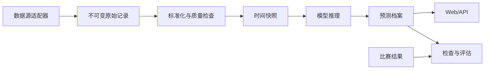

# 足球盘口预测平台产品方案

> 版本：V1.1  
> 状态：方案设计  
> 更新日期：2026-07-15

## 1. 产品定义

产品定位为：**基于纯盘口数据的赛前概率预测、临场监控与赛后复盘平台**。

最终覆盖范围：

- 英超、西甲、德甲、意甲、法甲
- 欧冠、欧联、欧协联
- 世界杯及预选赛
- 韩国 K1 联赛

所有预测默认针对：

> 常规时间 90 分钟及补时，不包含加时赛和点球大战。

产品不输出投注金额、投注组合、成本收益或回报承诺。

## 2. 核心输出

每场比赛在 `T-24h`、`T-6h`、`T-60m`、`T-10m` 生成不可修改的预测版本。

| 输出 | 定义 |
| --- | --- |
| 胜平负 | 去除返还率并校准后的概率 |
| 预测结论 | 主胜、平局、客胜或双重机会倾向 |
| 市场隐含进球 | 由欧赔、让球和大小球联合反演 |
| 比分点 | 概率最高的三个常规时间比分 |
| 总进球 | `0-1`、`2-3`、`4+` 概率 |
| 双方进球 | Yes/No 概率 |
| 市场状态 | 共识、分歧、反转或异常 |
| 置信等级 | 基于数据质量和历史校准计算 |
| 风险标签 | 缺失、过期、冲突、剧烈变化等 |
| 追溯信息 | 截止时间、数据版本、模型版本 |

“市场隐含进球”不能称为真实 xG，比分点只作为低权重衍生结果。

## 3. 数据准入契约

正式开发前，候选数据源必须通过以下验证：

- 支持欧赔、亚洲让球、大小球及准确更新时间
- 历史数据和实时数据结构一致
- 允许合法保存、分析和持续使用
- 球队、赛事、公司具有稳定 ID
- 能识别初盘、即时盘、封盘、恢复和修正
- 核心字段完整率不低于 `99%`
- 目标比赛三类市场覆盖率不低于 `95%`
- 重复和时间倒序记录低于 `0.1%`
- 随机抽查至少 500 场比赛，与展示源基本一致

每条原始记录必须保存原始响应、来源、内容哈希和四个时间字段：

```text
source_event_time   数据源声明的变盘时间
observed_at         系统首次看到该记录的时间
ingested_at         写入数据库的时间
corrected_at        数据源事后修正时间
```

预测和回测只能使用 `observed_at <= prediction_cutoff` 的数据。

## 4. 数据处理规则

盘口统一转换为十进制赔率；亚洲让球和大小球使用 `0.25` 为最小单位，明确记录半赢、半输和走盘规则。

数据处理流程：

1. 原始数据只追加，不覆盖。
2. 标准化赛事、球队、公司、盘口和时间。
3. 对欧赔及两项盘分别去除返还率。
4. 使用稳健中位数形成市场共识，过滤明显错误值。
5. 生成固定时间点的 as-of 快照。
6. 数据不足时降级预测或停止发布。

供应商事后修正的数据可以用于数据治理，但不得改写已经发布的历史预测。

## 5. 模型体系

### 5.1 市场基线

使用同一预测时间点的多公司去水概率形成基线。任何增强模型都必须与这个基线比较，而不是与更早的初盘比较。

### 5.2 盘口反演

联合拟合欧赔、亚洲让球和大小球，估算主客队进球参数，通过 Dixon-Coles 生成比分矩阵。若三类盘口无法一致拟合，保留残差并降低置信度。

### 5.3 变化增强

使用 LightGBM 学习初盘到当前时间点的：

- 概率变化、盘口升降和水位变化
- 变化速度、次数、持续时间和回撤
- 公司分歧及异常偏离
- 欧赔、让球、大小球的一致程度
- 距离开球时间、赛事和比赛阶段

公司权重只能通过预测时间之前的历史数据学习，禁止使用全量数据计算。

### 5.4 分层校准

五大联赛和 K1 分赛事校准；欧战增加两回合及中立场标记；世界杯使用跨赛事基础模型加国家队赛事校准，样本不足时自动扩大不确定区间。

## 6. 置信度与风险

置信度不等于最大胜率，由以下因素共同计算：

- 数据完整度、新鲜度和公司数量
- 三类市场的一致性
- 公司间离散程度
- 当前样本是否超出训练分布
- 模型历史校准误差
- 参数拟合残差和预测方差

高、中、低置信组必须在历史数据中呈现可验证的质量差异。缺少任一核心市场、数据过期或发生剧烈冲突时，不得发布高置信预测。

## 7. 回测协议

禁止随机拆分比赛，统一采用时间滚动验证：

```text
历史训练区间 -> 后续验证区间 -> 再向前滚动
```

每个赛事和预测时间点分别报告：

| 目标 | 主要指标 |
| --- | --- |
| 胜平负 | Log Loss、Brier Score、RPS |
| 概率校准 | ECE、可靠性曲线 |
| 进球分布 | 分布 Log Loss、Poisson Deviance |
| 比分点 | Top-1、Top-3 命中率，仅作辅助指标 |

上线门槛：

- 任意预测可由原始数据、截止时间和模型版本完全复现
- 与同时间点市场基线相比，Log Loss 非劣化幅度不超过 `0.5%`
- 目标是取得至少 `1%` 的稳定改善，但不作为首版强制承诺
- 整体 ECE 不高于 `0.03`
- 分赛事结果不能被少数高样本联赛掩盖
- 使用 bootstrap 给出 `95%` 置信区间

## 8. 产品页面

### 8.1 比赛中心

按日期、赛事、比赛状态、预测方向、置信度和风险标签筛选比赛。

### 8.2 单场分析

展示盘口时间线、公司分歧、市场隐含进球、比分矩阵以及四个预测版本的变化。

### 8.3 临场监控

监控盘口异动、跨市场冲突和预测方向变化，并保留变化发生时间和前后值。

### 8.4 预测档案

查看所有冻结的预测版本。已发布版本禁止事后覆盖，仅允许创建带原因的新版本。

### 8.5 检查复盘

比赛结束后自动结算，标记预测偏差、数据异常、盘口反转及特殊比赛状态。

### 8.6 模型仪表盘

按赛事、赛季、模型版本和预测时间点展示回测、概率校准及样本量。

### 8.7 数据质量中心

集中展示数据缺失、延迟、重复、映射冲突、异常赔率和采集失败。

延期比赛重新建立预测周期；取消比赛不结算；淘汰赛仍以 90 分钟赛果为预测目标。

## 9. 技术方案

MVP 使用 Python、FastAPI、PostgreSQL、独立采集 Worker、React 和 ECharts。暂不默认引入 TimescaleDB、Redis、Celery，达到明确的数据量或并发阈值后再扩展。



核心数据表：

- `competitions`
- `seasons`
- `teams`
- `fixtures`
- `bookmakers`
- `market_events`
- `market_snapshots`
- `predictions`
- `prediction_scores`
- `results`
- `evaluations`
- `model_versions`
- `data_quality_events`

时间统一按 UTC 保存，界面默认使用 Asia/Shanghai。

## 10. 分阶段交付

### 第一阶段：数据验证

接入一个候选数据源，抽查至少 500 场比赛，形成数据质量报告、字段契约和球队/赛事映射规则。

### 第二阶段：离线基线

以英超和 K1 为样本，完成去水概率、盘口反演、固定时间快照和严格时间滚动回测。

### 第三阶段：MVP

实现比赛中心、单场分析、四个预测版本、预测档案和自动检查复盘。

### 第四阶段：联赛扩展

覆盖全部五大联赛，加入盘口变化增强模型、置信度和数据质量中心。

### 第五阶段：杯赛扩展

支持欧战两回合、中立场、世界杯和预选赛的专项特征与分层校准。

### 第六阶段：实时化

实现临场采集、异常提醒、任务重试、运行监控和模型漂移检测。

## 11. MVP 验收标准

- 支持英超和 K1 的历史盘口数据导入与标准化
- 保存完整的原始记录、时间戳和数据来源
- 自动生成四个固定时间点的预测快照
- 输出胜平负、市场隐含进球、三个比分点、进球区间和置信度
- 比赛结束后自动检查并生成评估记录
- 回测严格禁止使用预测截止时间之后的数据
- 模型达到既定非劣化、校准和可复现门槛
- 数据缺失时能够降级或停止预测
- 延期、取消、加时等比赛不会被错误结算

## 12. 第一阶段交付物

在进入完整产品开发前，应完成：

1. 《数据源验收报告》
2. 《盘口数据字典》
3. 《时间快照与防数据泄漏规范》
4. 《英超与 K1 历史回测报告》

只有数据源和离线基线通过验收后，才进入完整产品开发。
